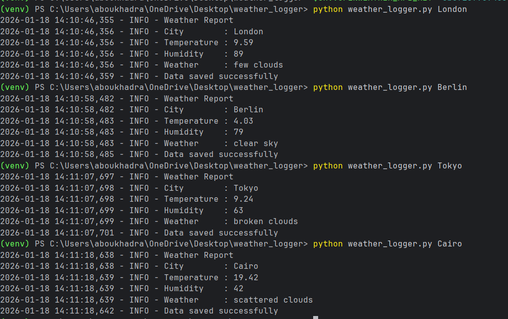

# 🌦️ Weather Data Logger CLI

A professional Python CLI application that fetches real-time weather data
and 5-day forecast using the OpenWeatherMap API, with clean architecture
and production-ready practices.




---

## 🚀 Features
- CLI Tool (argparse)
- Object-Oriented Design
- Logging (Console + File)
- JSON & CSV persistence
- 5-Day Weather Forecast
- Country detection
- Secure API key handling (Environment Variables)
- Unit Tests with pytest
- CI with GitHub Actions

---

## 🛠️ Tech Stack
- Python 3.12
- requests
- pytest
- GitHub Actions

---
## 📌 Author

Fares Essam
## 📦 Installation

```bash
git clone https://github.com/faresessam77/weather-logger.git
cd weather-logger
python -m venv venv
source venv/bin/activate  # Windows: venv\Scripts\activate
pip install -r requirements.txt
